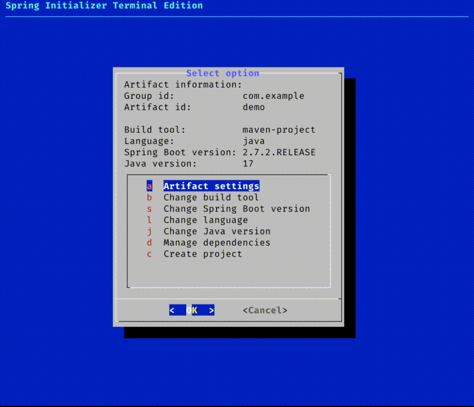

# Spring Starter Terminal
Simple script that uses dialog as a terminal UI for creating new Spring application using the Spring Starter / Spring Initializer service. A little quick and dirty, and the UI has major room for improvement relating to sizes. You can create a project, and it will unpack in the folder you are running the script from (useful to have in PATH if you dare ;) ).

## Dependencies
- bash (or equivalent, also tested with zsh)
- Standard Unix tools (sed, curl)
- dialog
- jq

## What has been done?
- [x] Being able to choose various project settings like names, Java version, Spring Boot versions, dependencies etc. All from the Spring Starter service.
- [x] Creating a project in a new direcctory with the same name as the artifact id in the same directory that the script is ran. Should be no need to unpack manually
- [x] Making the choices in the sub-menus persistent
- [ ] Tuning the sizes of dialog-boxes to look better
- [ ] Adding other possible choices that may be important to some people
- [x] Making the scripts work on Mac OS X and other possible environments where command line options to programs may differ
- [ ] Making the script pretty and refactoring
